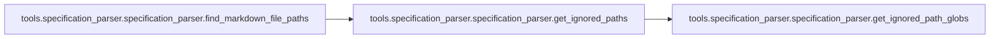
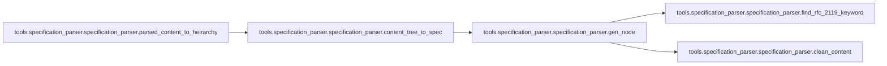
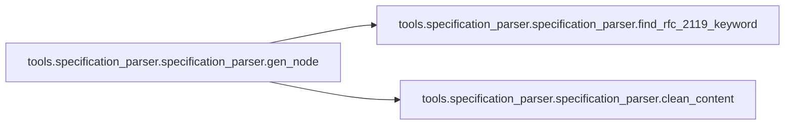
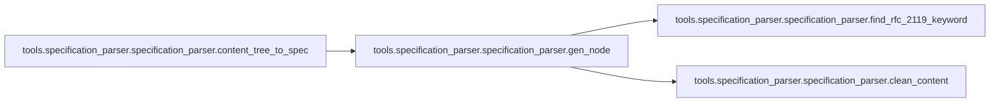

# Tools Specification Parser

[_Documentation generated by Documatic_](https://www.documatic.com)

<!---Documatic-section-Codebase Structure-start--->
## Codebase Structure

<!---Documatic-block-system_architecture-start--->
```mermaid
None
```
<!---Documatic-block-system_architecture-end--->

# #
<!---Documatic-section-Codebase Structure-end--->

<!---Documatic-section-tools.specification_parser.lint_json_output.main-start--->
## tools.specification_parser.lint_json_output.main

<!---Documatic-section-main-start--->
<!---Documatic-block-tools.specification_parser.lint_json_output.main-start--->
<details>
	<summary><code>tools.specification_parser.lint_json_output.main</code> code snippet</summary>

```python
def main(f):
    errors = 0
    with open(f) as jsonfile:
        spec = json.load(jsonfile)
        entries = []
        machineid_seen = []
        for entry in spec['rules']:
            machineid_seen += [entry['machine_id']]
            entries.append(entry)
            for child in entry.get('children', []):
                entries.append(child)
        if len(machineid_seen) != len(set(machineid_seen)):
            duped = set([x for x in machineid_seen if machineid_seen.count(x) > 1])
            print(f'There were duplicated machine ids in the list. This means two things claim to be the same rule number. Duplicated thing: {duped}', file=sys.stderr)
        try:
            for entry in entries:
                if entry.get('RFC 2119 keyword') is None and 'condition' not in entry['id'].lower():
                    print(f"{jsonfile.name}: Rule {entry['id']} is missing a RFC 2119 keyword", file=sys.stderr)
                    errors += 1
                pass
        except Exception as k:
            print(f'Non json-spec formatted file found: {jsonfile.name}', file=sys.stderr)
    sys.exit(errors)
```
</details>
<!---Documatic-block-tools.specification_parser.lint_json_output.main-end--->
<!---Documatic-section-main-end--->

# #
<!---Documatic-section-tools.specification_parser.lint_json_output.main-end--->

<!---Documatic-section-tools.specification_parser.specification_parser.get_ignored_path_globs-start--->
## tools.specification_parser.specification_parser.get_ignored_path_globs

<!---Documatic-section-get_ignored_path_globs-start--->
<!---Documatic-block-tools.specification_parser.specification_parser.get_ignored_path_globs-start--->
<details>
	<summary><code>tools.specification_parser.specification_parser.get_ignored_path_globs</code> code snippet</summary>

```python
def get_ignored_path_globs(root):
    fileName = join(root, '.specignore')
    if not isfile(fileName):
        return []
    with open(fileName, 'r') as f:
        globs = [line.strip() for line in f.readlines()]
        globs = [g for g in globs if g]
        globs = [g for g in globs if not g.startswith('#')]
        return globs
```
</details>
<!---Documatic-block-tools.specification_parser.specification_parser.get_ignored_path_globs-end--->
<!---Documatic-section-get_ignored_path_globs-end--->

# #
<!---Documatic-section-tools.specification_parser.specification_parser.get_ignored_path_globs-end--->

<!---Documatic-section-tools.specification_parser.specification_parser.get_ignored_paths-start--->
## tools.specification_parser.specification_parser.get_ignored_paths

<!---Documatic-section-get_ignored_paths-start--->


### Object Calls

* tools.specification_parser.specification_parser.get_ignored_path_globs

<!---Documatic-block-tools.specification_parser.specification_parser.get_ignored_paths-start--->
<details>
	<summary><code>tools.specification_parser.specification_parser.get_ignored_paths</code> code snippet</summary>

```python
def get_ignored_paths(root):
    globs = get_ignored_path_globs(root)
    globbed_paths = set()
    ignored_files = set()
    for g in globs:
        globbed_paths.update(glob.glob(g, recursive=True))
    for p in globbed_paths:
        if isfile(p):
            ignored_files.add(join(root, p))
        else:
            ignored_files.update(glob.glob(join(root, p, '**/*.md'), recursive=True))
    return ignored_files
```
</details>
<!---Documatic-block-tools.specification_parser.specification_parser.get_ignored_paths-end--->
<!---Documatic-section-get_ignored_paths-end--->

# #
<!---Documatic-section-tools.specification_parser.specification_parser.get_ignored_paths-end--->

<!---Documatic-section-tools.specification_parser.specification_parser.find_markdown_file_paths-start--->
## tools.specification_parser.specification_parser.find_markdown_file_paths

<!---Documatic-section-find_markdown_file_paths-start--->


### Object Calls

* tools.specification_parser.specification_parser.get_ignored_paths

<!---Documatic-block-tools.specification_parser.specification_parser.find_markdown_file_paths-start--->
<details>
	<summary><code>tools.specification_parser.specification_parser.find_markdown_file_paths</code> code snippet</summary>

```python
def find_markdown_file_paths(root):
    markdown_file_paths = []
    ignored_paths = get_ignored_paths(root)
    for (root_path, _, file_paths) in walk(root):
        for file_path in file_paths:
            absolute_file_path = join(root_path, file_path)
            if absolute_file_path in ignored_paths:
                continue
            (_, file_extension) = splitext(absolute_file_path)
            if file_extension == '.md':
                markdown_file_paths.append(absolute_file_path)
    return markdown_file_paths
```
</details>
<!---Documatic-block-tools.specification_parser.specification_parser.find_markdown_file_paths-end--->
<!---Documatic-section-find_markdown_file_paths-end--->

# #
<!---Documatic-section-tools.specification_parser.specification_parser.find_markdown_file_paths-end--->

<!---Documatic-section-tools.specification_parser.specification_parser.clean_content-start--->
## tools.specification_parser.specification_parser.clean_content

<!---Documatic-section-clean_content-start--->
<!---Documatic-block-tools.specification_parser.specification_parser.clean_content-start--->
<details>
	<summary><code>tools.specification_parser.specification_parser.clean_content</code> code snippet</summary>

```python
def clean_content(content):
    lines = content.splitlines()
    content = '\n'.join([x for x in lines if x.strip() != '' and x.strip().startswith('>')])
    for rfc_2119_keyword_regex in rfc_2119_keywords_regexes:
        content = re.sub(f'\\*\\*{rfc_2119_keyword_regex}\\*\\*', rfc_2119_keyword_regex, content)
    return re.sub('\\n?>\\s*', ' ', content.strip()).strip()
```
</details>
<!---Documatic-block-tools.specification_parser.specification_parser.clean_content-end--->
<!---Documatic-section-clean_content-end--->

# #
<!---Documatic-section-tools.specification_parser.specification_parser.clean_content-end--->

<!---Documatic-section-tools.specification_parser.specification_parser.find_rfc_2119_keyword-start--->
## tools.specification_parser.specification_parser.find_rfc_2119_keyword

<!---Documatic-section-find_rfc_2119_keyword-start--->
<!---Documatic-block-tools.specification_parser.specification_parser.find_rfc_2119_keyword-start--->
<details>
	<summary><code>tools.specification_parser.specification_parser.find_rfc_2119_keyword</code> code snippet</summary>

```python
def find_rfc_2119_keyword(content):
    for rfc_2119_keyword_regex in rfc_2119_keywords_regexes:
        if re.search(f'\\*\\*{rfc_2119_keyword_regex}\\*\\*', content) is not None:
            return rfc_2119_keyword_regex
```
</details>
<!---Documatic-block-tools.specification_parser.specification_parser.find_rfc_2119_keyword-end--->
<!---Documatic-section-find_rfc_2119_keyword-end--->

# #
<!---Documatic-section-tools.specification_parser.specification_parser.find_rfc_2119_keyword-end--->

<!---Documatic-section-tools.specification_parser.specification_parser.parsed_content_to_heirarchy-start--->
## tools.specification_parser.specification_parser.parsed_content_to_heirarchy

<!---Documatic-section-parsed_content_to_heirarchy-start--->


### Object Calls

* tools.specification_parser.specification_parser.content_tree_to_spec

<!---Documatic-block-tools.specification_parser.specification_parser.parsed_content_to_heirarchy-start--->
<details>
	<summary><code>tools.specification_parser.specification_parser.parsed_content_to_heirarchy</code> code snippet</summary>

```python
def parsed_content_to_heirarchy(parsed_content):
    content_tree = []
    headline_stack = []
    node = lambda l, h, c: {'level': l, 'headline': h, 'content': c, 'children': []}
    for (level, headline, content) in parsed_content:
        try:
            if len(headline_stack) == 0:
                cur = node(level, headline, content)
                content_tree.append(cur)
                headline_stack.insert(0, [level, headline, cur])
            elif len(headline_stack[0][0]) >= len(level):
                if len(headline_stack[0][0]) > len(level):
                    headline_stack.pop(0)
                headline_stack.pop(0)
                if len(headline_stack) == 0:
                    parent = content_tree
                else:
                    parent = headline_stack[0][2]['children']
                cur = node(level, headline, content)
                parent.append(cur)
                headline_stack.insert(0, [level, headline, cur])
            elif len(level) > len(headline_stack[0][0]):
                cur = node(level, headline, content)
                parent = headline_stack[0][2]
                parent['children'].append(cur)
                headline_stack.insert(0, [level, headline, cur])
            else:
                headline_stack.pop(0)
        except Exception as k:
            print(k)
    root = node(0, '', '')
    root['children'] = content_tree
    return content_tree_to_spec(root)
```
</details>
<!---Documatic-block-tools.specification_parser.specification_parser.parsed_content_to_heirarchy-end--->
<!---Documatic-section-parsed_content_to_heirarchy-end--->

# #
<!---Documatic-section-tools.specification_parser.specification_parser.parsed_content_to_heirarchy-end--->

<!---Documatic-section-tools.specification_parser.specification_parser.gen_node-start--->
## tools.specification_parser.specification_parser.gen_node

<!---Documatic-section-gen_node-start--->


### Object Calls

* tools.specification_parser.specification_parser.find_rfc_2119_keyword
* tools.specification_parser.specification_parser.clean_content

<!---Documatic-block-tools.specification_parser.specification_parser.gen_node-start--->
<details>
	<summary><code>tools.specification_parser.specification_parser.gen_node</code> code snippet</summary>

```python
def gen_node(ct):
    headline = ct['headline']
    content = ct['content']
    keyword = find_rfc_2119_keyword(content)
    req_group = re.search('(?P<req>(requirement|condition)[^\\n]+)', headline, re.IGNORECASE)
    if req_group is None:
        return None
    _id = req_group.groups()[0]
    return {'id': _id, 'machine_id': re.sub('[^\\w]', '_', _id.lower()), 'content': clean_content(content), 'RFC 2119 keyword': keyword, 'children': []}
```
</details>
<!---Documatic-block-tools.specification_parser.specification_parser.gen_node-end--->
<!---Documatic-section-gen_node-end--->

# #
<!---Documatic-section-tools.specification_parser.specification_parser.gen_node-end--->

<!---Documatic-section-tools.specification_parser.specification_parser.content_tree_to_spec-start--->
## tools.specification_parser.specification_parser.content_tree_to_spec

<!---Documatic-section-content_tree_to_spec-start--->


### Object Calls

* tools.specification_parser.specification_parser.gen_node

<!---Documatic-block-tools.specification_parser.specification_parser.content_tree_to_spec-start--->
<details>
	<summary><code>tools.specification_parser.specification_parser.content_tree_to_spec</code> code snippet</summary>

```python
def content_tree_to_spec(ct):
    current = gen_node(ct)
    children_grouped = [content_tree_to_spec(x) for x in ct['children']]
    children = []
    for _iter in children_grouped:
        '\n        So we might get a None (skip it), an object (add it to the list) or another list (merge it with list).\n        '
        if _iter is None:
            continue
        if type(_iter) == list:
            children.extend(_iter)
        else:
            children.append(_iter)
    if current is None:
        if len(children) > 0:
            return children
        return
    else:
        current['children'] = children
        return current
```
</details>
<!---Documatic-block-tools.specification_parser.specification_parser.content_tree_to_spec-end--->
<!---Documatic-section-content_tree_to_spec-end--->

# #
<!---Documatic-section-tools.specification_parser.specification_parser.content_tree_to_spec-end--->

<!---Documatic-section-tools.specification_parser.specification_parser.parse-start--->
## tools.specification_parser.specification_parser.parse

```mermaid
flowchart LR
tools.specification_parser.specification_parser.parse-->tools.specification_parser.specification_parser.parsed_content_to_heirarchy
tools.specification_parser.specification_parser.parsed_content_to_heirarchy-->tools.specification_parser.specification_parser.content_tree_to_spec
tools.specification_parser.specification_parser.content_tree_to_spec-->tools.specification_parser.specification_parser.gen_node
tools.specification_parser.specification_parser.gen_node-->tools.specification_parser.specification_parser.find_rfc_2119_keyword
tools.specification_parser.specification_parser.gen_node-->tools.specification_parser.specification_parser.clean_content
```

<!---Documatic-section-parse-start--->


### Object Calls

* tools.specification_parser.specification_parser.parsed_content_to_heirarchy

<!---Documatic-block-tools.specification_parser.specification_parser.parse-start--->
<details>
	<summary><code>tools.specification_parser.specification_parser.parse</code> code snippet</summary>

```python
def parse(markdown_file_path):
    with open(markdown_file_path, 'r') as markdown_file:
        content_finder = re.compile('^(?P<level>#+)(?P<headline>[^\\n]+)(?P<rest>[^#]*)', re.MULTILINE)
        parsed = content_finder.findall(markdown_file.read())
        return parsed_content_to_heirarchy(parsed)
```
</details>
<!---Documatic-block-tools.specification_parser.specification_parser.parse-end--->
<!---Documatic-section-parse-end--->

# #
<!---Documatic-section-tools.specification_parser.specification_parser.parse-end--->

<!---Documatic-section-tools.specification_parser.specification_parser.write_json_specifications-start--->
## tools.specification_parser.specification_parser.write_json_specifications

<!---Documatic-section-write_json_specifications-start--->
<!---Documatic-block-tools.specification_parser.specification_parser.write_json_specifications-start--->
<details>
	<summary><code>tools.specification_parser.specification_parser.write_json_specifications</code> code snippet</summary>

```python
def write_json_specifications(requirements):
    for (md_absolute_file_path, requirement_sections) in requirements.items():
        with open(''.join([splitext(md_absolute_file_path)[0], '.json']), 'w') as json_file:
            json_file.write(json.dumps(requirement_sections, indent=4))
```
</details>
<!---Documatic-block-tools.specification_parser.specification_parser.write_json_specifications-end--->
<!---Documatic-section-write_json_specifications-end--->

# #
<!---Documatic-section-tools.specification_parser.specification_parser.write_json_specifications-end--->

[_Documentation generated by Documatic_](https://www.documatic.com)